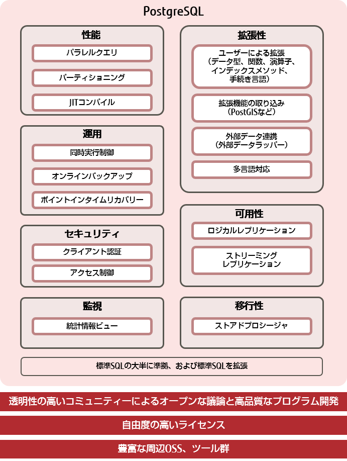

# PostgreSQLについて
PostgreSQL（ポストグレスキューエル）は、オープンソースソフトウェア（OSS）のリレーショナルデータベース管理システム（RDBMS）です。
[リレーショナルデータベース管理システム（RDBMS）](\\wsl.localhost\Ubuntu\root\Projects\TIL\0124\リレーショナルデータベース管理システム（RDBMS）.md)

# 特徴
- ライセンスコストがかからないこと、
- 世界中の技術者による知見によって開発される高品質なプログラムであること、
- ベンダーロックインを回避できることなど、OSSならではのメリットに加え、商用に耐えうる機能の豊富さや性能、堅牢性、拡張性を備えています。

- 商用を含めてあらゆる目的に無償で利用できます。（著作権表示とライセンス条項をすべてのコピーに含めていれば）

又、OSSに適用されるライセンスの一種であるBSDライセンスに基づいたPostgreSQLライセンスを採用している。機能の改変や追加を行っても、そのソースコードを公開する義務はありません。このライセンスがPostgreSQLの適用範囲を広げる一因となっています。

# PostgreSQLが多くの企業に採用される理由
## 商用に耐えうる機能群
- 商用に適用できるデータベースの基本機能を搭載しており、これまでオンラインバックアップ、マルチスレッド、ストリーミングレプリケーションなどのエンタープライズ向けの機能を強化してきました。

- 標準SQLの大半に準拠していることから他のデータベースシステムとの親和性が高く、基幹システムの商用データベースとの連携や移行がしやすくなる。

- 業務や事業拡張に伴う、多種多様な形式のデータ（システム）と連携するための機能も備えており、IoTやビッグデータ活用を視野に入れた機能開発も進んでいます。

以下の図に、PostgreSQLの基本的な機能と特徴をまとめました。

# 参考資料
* * *
[【PostgreSQLとは？】
入門者向けに特徴をわかりやすく解説
PostgreSQLインサイド](https://www.fujitsu.com/jp/products/software/resources/feature-stories/postgres/what-is-postgresql/)